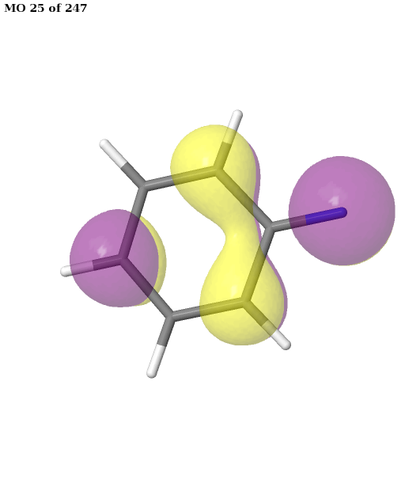

Calculation of singlet triplet-splittings of organic diradicals
###############################################################
Diradicals are defined as species having two unpaired electrons, according to IUPAC, in which at least two different electronic states
with different multiplicities (e.g., singlet and triplet) can be identified.
Diradical species are often the result of having degenerate (or nearly-degenerate) molecular orbitals.
Considering two nearly degenerate molecular orbitals *a* and *b*, one can distribute the electrons to form three singlet states and three degenerate
triplet states as shown below.

    Pictorial representation of a two electron, two orbital system.

The singlet state formed by two unpaired electrons is a combination of two slater determinants (negative sign in the
curly brackets in the picture above). Therefore multi-reference methods are commonly employed,
to calculate the singlet-triplet energy difference of diradicals; this, in turn, requires an active space selection.
You can find more information in
`"Magnetic Interactions in Molecules and Solid" <https://link.springer.com/book/10.1007/978-3-319-22951-5>`_.

This section reports on a small benchmark to analyze the performance of ASF in selecting active spaces for different diradicals.
We are mainly interested in assessing the selected active spaces. However, we will also compare the results to experimental measurements.

.. note::
   Please be aware that the calculated singlet-triplet gaps refer to vertical excitations, for the sake of simplicity. Furthermore,
   since the singlet-triplet gaps are typically quite small (order of kcal/mol), one should consider other effects, such as zero-point energy (ZPE) corrections,
   when comparing to experimental data.

1 Computational methodology
-------------------------------
Calculations were performed for triplet equilibrium structures employing the ``def2-tzvp`` basis set. DF-CASSCF and NEVPT2 calculations were performed using PySCF.
For the DF approximation (Density fitting / resolution of identity), the default auxiliary basis sets selected by PySCF are used.

2 Benchmark list
--------------------------
All diradicals, used in this benchmark, are shown in the picture below.

The systems listed here can be classified into several groups based on the spatial orientations of the magnetic orbitals
(nearly or fully degenerate singly occupied orbitals). If the magnetic orbital are of :math:`\sigma` type, the diradicals are called "localized".
If both orbitals are of :math:`\pi` type, the diradicals are called "delocalized". However, there are also cases where one orbital is a :math:`\pi` one 
and the other is a :math:`\sigma` one; for instance, meta-benzoquinone has two magnetic :math:`\pi`  orbitals, while m-Benzyne has
two :math:`\sigma` orbitals, and phenyl-nitrene has one :math:`\sigma`\  and one :math:`\pi`\  magnetic orbital.
The magnetic orbitals of meta-benzoquinone and phenyl-nitrene are shown below. 
For more info, have a look at `this review article <https://doi.org/10.1021/cr400056a>`_.

3 Results from ASF
--------------------

.. table:: All units in kcal/mol. Negative means triplet ground state. SOMO (singly occupied orbital).

   +---------------------------------------------+-------------------+---------------------+-----------+-----------+-------+
   | System (SOMOs spatial orientation)          | auto active space | manual active space | CASSCF-ST | NEVPT2-ST | Exp.  |
   +---------------------------------------------+-------------------+---------------------+-----------+-----------+-------+
   | m-Benzyne (σ-σ)                             | (8,8)             | (8,8)               | 11.75     | 14.94     | 12.28 |
   +---------------------------------------------+-------------------+---------------------+-----------+-----------+-------+
   | o-Benzyne (σ-σ)                             | (8,8)             | (8,8)               | 21.00     | 23.96     | 26.94 |
   +---------------------------------------------+-------------------+---------------------+-----------+-----------+-------+
   | p-Benzyne (σ-σ)                             | (8,8)             | (8,8)               | 2.21      | 2.93      | 1.27  |
   +---------------------------------------------+-------------------+---------------------+-----------+-----------+-------+
   | m-benzoquinone (mBQ) (π-π)                  | (8,8)             | (8,8)               | -13.32    | -12.22    | -9.0  |
   +---------------------------------------------+-------------------+---------------------+-----------+-----------+-------+
   | o-benzoquinone (oBQ) (π-π)                  | (8,8)             | (8,8)               | 48.58     | 44.14     | 38.7  |
   +---------------------------------------------+-------------------+---------------------+-----------+-----------+-------+
   | p-benzoquinone (pBQ) (π-π)                  | (8,8)             | (8,8)               | 65.98     | 65.18     | 53.5  |
   +---------------------------------------------+-------------------+---------------------+-----------+-----------+-------+
   | Phenyl-nitrene (σ-π)                        | (8,8)             | (8,8)               | -19.04    | -18.95    | -14.8 |
   +---------------------------------------------+-------------------+---------------------+-----------+-----------+-------+
   | m-xylylene (π-π)                            | (8,8)             | (8,8)               | -16.12    | -11.93    | -9.6  |
   +---------------------------------------------+-------------------+---------------------+-----------+-----------+-------+
   | Tetraoxatetramethylenebenzene (TOTMB) (π-π) | (10,10)           | (10,10)             | 2.36      | 2.83      | -3.45 |
   +---------------------------------------------+-------------------+---------------------+-----------+-----------+-------+

4 Comparison to result using a minimal active space.
------------------------------------------------------

.. table:: All units in kcal/mol. Negative means triplet ground state. The minimal active space is (2, 2) and is labelled by the prefix "m".

   +---------------------------------------+-----------+-----------+------------+------------+-------+
   | System                                | CASSCF-ST | NEVPT2-ST | mCASSCF-ST | mNEVPT2-ST | Exp.  |
   +---------------------------------------+-----------+-----------+------------+------------+-------+
   | m-Benzyne                             | 11.75     | 14.94     | 9.78       | 14.04      | 12.28 |
   +---------------------------------------+-----------+-----------+------------+------------+-------+
   | o-Benzyne                             | 21.00     | 23.96     | 15.74      | 24.61      | 26.94 |
   +---------------------------------------+-----------+-----------+------------+------------+-------+
   | p-Benzyne                             | 2.21      | 2.93      | 0.38       | 1.98       | 1.27  |
   +---------------------------------------+-----------+-----------+------------+------------+-------+
   | m-benzoquinone (mBQ)                  | -13.32    | -12.22    | -8.65      | -13.95     | -9.0  |
   +---------------------------------------+-----------+-----------+------------+------------+-------+
   | o-benzoquinone (oBQ)                  | 48.58     | 44.14     | 45.69      | 48.81      | 38.7  |
   +---------------------------------------+-----------+-----------+------------+------------+-------+
   | p-benzoquinone (pBQ)                  | 65.98     | 65.18     | 80.35      | 54.52      | 53.5  |
   +---------------------------------------+-----------+-----------+------------+------------+-------+
   | Phenyl-nitrene                        | -19.04    | -18.95    | -23.57     | -10.66     | -14.8 |
   +---------------------------------------+-----------+-----------+------------+------------+-------+
   | m-xylylene                            | -16.12    | -11.93    | -4.91      | -11.59     | -9.6  |
   +---------------------------------------+-----------+-----------+------------+------------+-------+
   | Tetraoxatetramethylenebenzene (TOTMB) | 2.36      | 2.83      | 1.77       | 3.19       | -3.45 |
   +---------------------------------------+-----------+-----------+------------+------------+-------+
