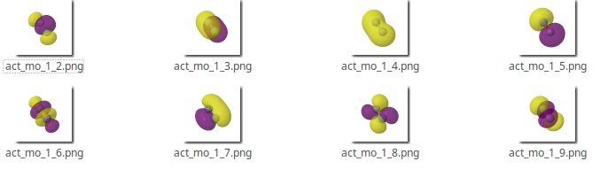
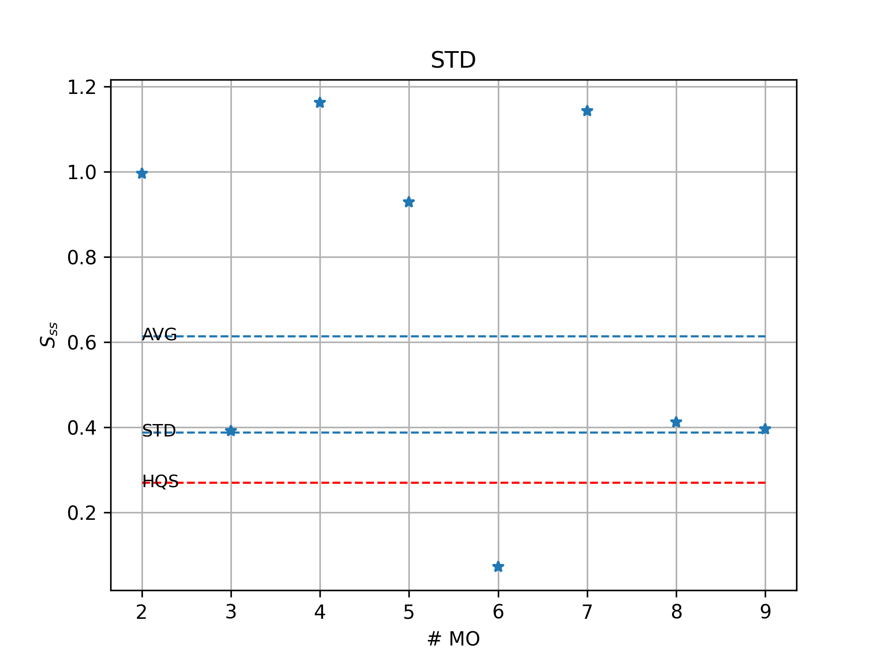

Tutorials
==========

1. Basics: The active space of :math:`Fe(OH_2)_4`\
####################################################

In this section we will mainly focus on how to use the ASF in order to find
a reasonable active space for :math:`Fe(OH_2)_4`\ groundstate. 
The first examples is using the wrapper function. The second example uses AVAS
instead of natural orbitals for an initial guess. The last example follows
a more advanced symmetric calculation of several :math:`Fe(OH_2)_4`\ excitation energies.

1.1 The wrapper function (predefined strategy)
-----------------------------------------------
Providing a converged SCF object you can simply call the wrapper function to provide you with an active space.
An example script for this case can be found under ``/examples/simple/fe.py``.

At the beginning of the script we set the coordinates spin and charge of the system.
The :math:`Fe(OH_2)_4`\ molecule is then set up as a PySCF ``Mole`` object.

.. literalinclude:: ../../examples/simple/fe.py
   :language: python
   :lines: 5-35

Then use Pyscf to converge the meanfield.
(\*.chk, stores molecular orbital coefficients, etc.).
It is recommended to assure convergence of mean field before further calculations.

.. literalinclude:: ../../examples/simple/fe.py
   :language: python
   :lines: 36-39

The we simply input the mean field object into the :meth:`asf.asf.fas_no_guess` function.

.. literalinclude:: ../../examples/simple/fe.py
   :language: python
   :lines: 41-45

The function calculates the 'MP2' natural orbitals then selects an initial set of orbitals.
With the selected orbitals a large DMRGCI calculations is performed. The orbital
entropies are calculated from the DMRGCI results and the final active space is 
chosen from the entropies.

::

   --------Wrapper function--------

   ---------------------
   Natural orbital selected active space
   orbitals: 11 , electrons: 17
   ---------------------

   -----------ASF-RUN----------
   Active space:  [33, 34, 35, 36, 37, 38, 39, 40, 41, 42, 43]
   Active electrons:  17
   Entropies in memory or entered manually now:  None
   Run DMRG:  True
   symmetry:  
   Spin, Muliplicity:  3 , 3.75

   DMRG calculation was performed on 17 e- in 11 MOs (w/ None DMRG M, None DMRG Sweeps,  251 DMRG_MaxM)
   Time taken for DMRG calculation: 29.368440922000445 seconds

   Single site MO entropies and orbital occupations:
   Starting from 0.
   root # 0
   S[MO 33] = 0.0147,  natural occ = 2.0000,  SCF OCC = 2.0000
   S[MO 34] = 0.0002,  natural occ = 1.9981,  SCF OCC = 2.0000
   S[MO 35] = 0.0083,  natural occ = 1.9979,  SCF OCC = 2.0000
   S[MO 36] = 0.0393,  natural occ = 1.9978,  SCF OCC = 2.0000
   S[MO 37] = 0.0086,  natural occ = 1.9945,  SCF OCC = 2.0000
   S[MO 38] = 0.0994,  natural occ = 1.9824,  SCF OCC = 2.0000
   S[MO 39] = 0.3694,  natural occ = 1.9031,  SCF OCC = 2.0000
   S[MO 40] = 0.5691,  natural occ = 1.0168,  SCF OCC = 1.0000
   S[MO 41] = 0.5210,  natural occ = 1.0052,  SCF OCC = 1.0000
   S[MO 42] = 0.4998,  natural occ = 1.0018,  SCF OCC = 1.0000
   S[MO 43] = 0.3744,  natural occ = 0.1025,  SCF OCC = 0.0000

   ASF suggested active space for root #0:                      
   Put 5 e- in these 5 MOs:[39, 40, 41, 42, 43] with TH:0.19329214162255237

1.2 AVAS as initial guess
--------------------------
Calculation using AVAS as initial guess is done similarly.
An example script for this case can be found under ``examples/avas/c2.py``.
First we converge the meanfield object as mentioned before. Then,
we call AVAS to select an active space for us.

.. literalinclude:: ../../examples/avas/c2.py
   :language: python
   :lines: 28-30

AVAS will provide an active space of selected atomic orbital labels.
You can view the molecular orbitals selected by AVAS using a utility function. This function
also creates a molden file which you can view using jmol or ...

.. literalinclude:: ../../examples/avas/c2.py
   :language: python
   :lines: 32-36

This active space pre-selection is used for final active space selection via
ASFs :meth:`asf.asf.find_active_space` function:

.. literalinclude:: ../../examples/avas/c2.py
   :language: python
   :lines: 38-39

After the final DMRG calculation finished, ASF prints the suggested active space:

::

   converged SCF energy = -75.305753989276
   RHF/RKS wavefunction has an internal instability
   converged SCF energy = -75.3245002956272
   RHF/RKS wavefunction is stable in the internal stability analysis
   splash_image=jar:file:/usr/share/java/Jmol-14.6.4+2016.11.05.jar!/org/openscience/jmol/app/images/Jmol_splash.jpg
   history file is /home/rshirazi/.jmol/history
   user properties file is /home/rshirazi/.jmol/properties
   (C) 2015 Jmol Development
   Jmol Version: 14.6.4_2016.11.05  2016-11-10 03:30
   java.vendor: Java: Ubuntu
   java.version: Java 11.0.8
   os.name: Linux
   Access: ALL
   memory: 21.7/130.0
   processors available: 8
   useCommandThread: false
   User macros dir: /home/rshirazi/.jmol/macros
         exists: false
   isDirectory: false
   Executing script: script "plot.spt";
   -----------ASF-RUN----------
   Active space:  8
   Active electrons:  8
   Entropies in memory or entered manually now:  None
   Run DMRG:  True
   symmetry:  
   Spin, Muliplicity:  0 , 0.0

   CASCI E = -75.4734674486849  E(CI) = -18.1261155581167  S^2 = 0.0000000
   DMRG calculation was performed on 8 e- in 8 MOs (w/ None DMRG M, None DMRG Sweeps,  251 DMRG_MaxM)
   Time taken for DMRG calculation: 4.180823569011409 seconds

   Single site MO entropies and orbital occupations:
   Starting from 0.
   root # 0
   S[MO 2] = 0.9950,  natural occ = 1.9857,  SCF OCC = 2.0000
   S[MO 3] = 0.3920,  natural occ = 1.8895,  SCF OCC = 2.0000
   S[MO 4] = 1.1616,  natural occ = 1.8891,  SCF OCC = 2.0000
   S[MO 5] = 0.9280,  natural occ = 1.3595,  SCF OCC = 2.0000
   S[MO 6] = 0.0728,  natural occ = 0.6442,  SCF OCC = 0.0000
   S[MO 7] = 1.1425,  natural occ = 0.1133,  SCF OCC = 0.0000
   S[MO 8] = 0.4117,  natural occ = 0.1070,  SCF OCC = 0.0000
   S[MO 9] = 0.3963,  natural occ = 0.0117,  SCF OCC = 0.0000

   ASF suggested active space for root #0:                      
   Put 8 e- in these 8 MOs:[2, 3, 4, 5, 6, 7, 8, 9] with TH:0.27069112074088336

2. Advanced: Calculation of vertical excitation energies
#########################################################
In this section we will extend the application of the ASF towards a more practical example, namely
the calculation of the vertical excitation energy of :math:`Fe(OH_2)_4`.
The code snippets for this example are located under ``/examples/advanced/fe_sym.py``.

Also in this calculation we use the natural orbital occupation from MP2 for the pre-selection
of the active space. In this example, we won't use the wrapper function.

After converging the meanfield as before, we Run MP2 calculations. To calculate the natural orbitals and their
occupation, you can use the :meth:`asf.nat_orbs_obj`, which returns the natural orbitals and their occupation.
You can plot the orbitals if you like by calling :meth:`asf.visualize_mos`, as mentioned before.
With the occupation numbers one can select an initial set of orbitals. Note that you can also select the orbitals by hand.
For this purpose you can use the :meth:`asf.asf.select_mos_occ`. For the details of threshold selection please look up
:meth:`asf.asf.calculate_criteria`.

.. literalinclude:: ../../examples/advanced/fe_sym.py
   :language: python
   :lines: 47-49

Now we set up an empty list and calculate the active space using the initial selection of natural orbitals, for
each symmetry and spin state. Here we are interested in 3 degenerate quintet states and one sextet state.
Proper symmetry of these states can be calculated by looking up the orbital symmetries and product table.
Note that in PySCF and Block not all the symmetries are available. For instance in our case the point group of the 
sextet aqua irion ion is Th, but PySCF uses the D2 symmetry.

.. literalinclude:: ../../examples/advanced/fe_sym.py
   :language: python
   :lines: 52-74

Now We use the lists of the orbital indexes and combine them to a larger list.

.. literalinclude:: ../../examples/advanced/fe_sym.py
   :language: python
   :lines: 77-78

We can now Converge the CASSCF wave function.

.. literalinclude:: ../../examples/advanced/fe_sym.py
   :language: python
   :lines: 111-114

We can now see the energy differences. All the quintet states are degenerate and
the sextet state:

::

   Excitation from A to B2:  0.0 eV
   Excitation from A to B3:  0.0 eV
   Excitation from A to B4:  0.0 eV
   Excitation from spin 3 to 5:  3.1340175047152385 eV

3. Utility functions
##################################################################

3.1 Visualizing the MOs with jmol
----------------------------------
In this section we will show how one can plot the ASF suggested active molecular orbitals.
We do this by taking again the :math:`C_2`\ example of section 1.2.

After the final DMRG calculation has provided us with the final active space selection, we can 
plot these MOs with ASFs :meth:`asf.asf.visualize_mos` function via the following command:

.. literalinclude:: ../../examples/avas/c2.py
   :language: python
   :lines: 36-36

By executing this command the four active molecular orbitals are plotted
to separate *png* files.

Furthermore, the whole set of MOs is stored in the ``asf_mos.molden`` file.

3. Plot selection thresholds :math:`C_2`\
--------------------------------------------------------
Visualization can be controlled by :math:`plot`\ attribute of both :meth:`asf.select_mos_occ` and
:meth:`asf.select_mos_ent` functions.

4. Calculation of natural orbitals
####################################
Natural orbitals for any post SCF calculation can be easily calculated with ASF. functions
for this purpose are store in ``/asf/nat_orbs.py``. The file containing the examples below
is located at ``/examples/natorbs/c2.py``.

4.1 Unrestricted natural orbitals
-----------------------------------
UNOs can be calulate by calling the :meth:`asf.UNOs` function.

.. literalinclude:: ../../examples/natorbs/c2.py
   :language: python
   :lines: 18-20

4.2 Wrapper function
----------------------
With the wrapper function you can simply call the nat_orbs_obj and pass it a MP2, CISD or CCSD object.
The function will calculate the symmetric (if mol object's symmetry is set) natural orbitals.

.. literalinclude:: ../../examples/natorbs/c2.py
   :language: python
   :lines: 22-32

4.3 Manual functions
----------------------
In case you are calculating the natural orbitals from other methods such as CASSCF
you can use directly provide rdm1 to the right function to calculate natural orbitals.

For instance in case of CASSCF you can use the :meth:`asf.nat_orbs_rdm1AO_rhf`. Please, note 
that most functions written in here require rdm1 in MO basis with the exception of :meth:`asf.nat_orbs_rdm1AO_rhf`.
If you require a to project your rdm1 from MO to AO basis you can look up some useful function for that
in utility section.

In script below we calculate the active space natural orbitals using both modes available in :meth:`asf.nat_orbs_rdm1AO_rhf`
and compare the overlap of both set of orbitals.

.. literalinclude:: ../../examples/natorbs/c2.py
   :language: python
   :lines: 34-58
