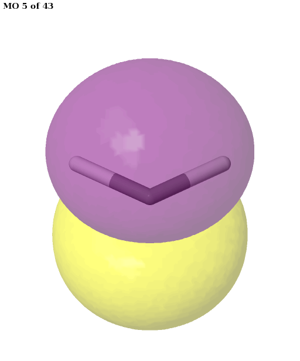

Tutorials
==========

1. Basic active space selection
###############################

In this section we go step by step through simple examples, highlighting
the output of the code, in order to introduce the user to the basic concepts
behind the ASF software. All input files are available in the ``example`` folder of the package.

1.1. Selecting an active space for ethene
-----------------------------------------

As an introductory example, we will demonstrate the selection of an active space for ethene
(:math:`\text{C}_2\text{H}_4`). While the ground state does not have a strongly correlated
wave function, it is suited to illustrate the basic ideas. The input for the
calculation is in the file :download:`examples/ethene/c2h4.py </../examples/ethene/c2h4.py>`.
Here, we will examine the input step by step.

Start by importing the required functionality of PySCF and the ASF:

.. literalinclude:: /../examples/ethene/c2h4.py
   :language: python
   :lines: 3-7

Next, we specify the molecule by instantiating a PySCF Mole object. The atomic positions are
contained in the file :download:`examples/ethene/c2h4.xyz </../examples/ethene/c2h4.xyz>` in the
same directory.

.. literalinclude:: /../examples/ethene/c2h4.py
   :language: python
   :lines: 9-16

Having set up the molecule, we pass it on to the "all-in-one" wrapper function, which also
performs the SCF calculation:

.. literalinclude:: /../examples/ethene/c2h4.py
   :language: python
   :lines: 18-31

The wrapper function performs an unrestricted Hartree-Fock (UHF) calculation first. Even if the
electronic state is a singlet, for strongly correlated molecules the UHF will typically undergo a
symmetry breaking, leading to a spin-contaminated wave function. This is done here on purpose.

A stability analysis is performed; even for ethene, it is possible to lower the energy
by introducing a small amount of spin contamination.

.. code-block:: none

   converged SCF energy = -77.9774983467955  <S^2> = 3.0890863e-09  2S+1 = 1

   Performing stability analysis.
   UHF/UKS wavefunction has an internal instability.

   SCF solution unstable.
   Restarting the SCF calculation.

The first solution is unstable, which triggers a new SCF calculation:

.. code-block:: none

   converged SCF energy = -77.977530565129  <S^2> = 0.032286977  2S+1 = 1.0626137

   Performing stability analysis.
   UHF/UKS wavefunction is stable in the internal stability analysis

   -> SCF solution converged and stable.

In more complicated cases, it may be preferable to set up and run the Hartree-Fock calculation
manually. In that case, the SCF object would be passed to the function
``asf.wrapper.runasf_from_scf``.

Having an SCF solution, a smaller orbital space needs to be found to perform a DMRG calculation.
While it would be possible to just select a window of Hartree-Fock orbitals based on their energy,
this is not generally a good approach to select active spaces. We made better experiences
with MP2 natural orbitals (which are calculated from an unrelaxed density, and have got associated
natural occupation numbers between two and zero). Please note that the active space is selected
from MP2 natural orbitals, not from SCF orbitals! When calling ``runasf_from_scf(mf, ...)`` with
an SCF object ``mf``, the list of active orbitals returned by the function does not refer to the
matrix ``mf.mo_coeff``. The active orbital list always refers to the MO coefficients, consisting
of MP2 natural orbitals, that are returned by ``runasf_from_mole`` and ``runasf_from_scf``.

.. code-block:: none

   --------------------------------------------------------------------------------
   Calculating MP2 natural orbitals
   --------------------------------------------------------------------------------

   [...]

   -> Selected initial orbital window of 12 electrons in 12 MP2 natural orbitals.

A special remark needs to be made regarding the MP2 implementation. PySCF 1.7.6 only has a
conventional implementation of MP2 for UHF references, which may become unfeasible for larger
systems. HQS contributed a more efficient DF-MP2 implementation to PySCF, which has been released
in version 2 of PySCF. The ASF code attempts to use the latter if it is available. Since the current version
of the ASF is based on PySCF 1.7.6, using the more efficient DF-MP2 implementation is somewhat
tricky, and requires `patching the code <https://github.com/pyscf/pyscf/pull/963>`_.
The most convenient way to install a patched PySCF together with Block is to use the build script
:download:`build_script/PySCF_Block.sh </../build_script/PySCF_Block.sh>` provided with ASF.

Having selected a subset of MP2 natural orbitals, these are normally used for a DMRG calculation.
However, if the number of orbitals is sufficiently small, the code performs a normal CASCI
calculation, instead. Based on the calculated entropies, an active space is selected:

.. code-block:: none

   Orbital selection for state 0:

   MO    w( )    w(↑)    w(↓)    w(⇅)       S  sel
    2   0.001   0.006   0.006   0.987   0.079     
    3   0.002   0.007   0.007   0.984   0.099     
    4   0.003   0.007   0.007   0.983   0.105     
    5   0.004   0.007   0.007   0.982   0.107     
    6   0.004   0.009   0.009   0.979   0.125     
    7   0.029   0.008   0.008   0.954   0.226    a
    8   0.954   0.008   0.008   0.030   0.228    a
    9   0.984   0.007   0.007   0.003   0.101     
   10   0.984   0.006   0.006   0.004   0.102     
   11   0.984   0.007   0.007   0.002   0.098     
   12   0.982   0.007   0.007   0.003   0.106     
   13   0.983   0.007   0.007   0.003   0.102

The first column contains the orbital index (counting starts from zero).
Columns two to five show the probability for each spatial orbital to have an 
occupation out of the four possibilities empty, spin-up, spin-down or doubly
occupied. The sixth column contains the one-orbital entropy. Finally, a flag in the seventh
column indicates whether an orbital has been selected for the active space.

We can create image files of the orbitals for visual inspection:

.. literalinclude:: /../examples/ethene/c2h4.py
   :language: python
   :lines: 33-34

.. image:: /media/c2h4_mo7.png
   :width: 250
.. image:: /media/c2h4_mo8.png
   :width: 250

As expected, the ASF selects an active space consisting of the HOMO and LUMO of ethane. Note that
Jmol (the software used to create the images) labels orbitals starting from one, not from zero.
The default entropy cutoff for orbital selection in the ASF wrapper functions ``runasf_from_[...]``
can be modified with the ``entropy_threshold`` keyword option, e.g.
``runasf_from_mole(..., entropy_threshold=0.2)``.

Having selected an active space, we are in a position to perform a CASSCF or CASCI calculation:

.. literalinclude:: /../examples/ethene/c2h4.py
   :language: python
   :lines: 36-50

Note that it is important to reorder the columns of the MO coefficients before passing them to a
CAS object. 

The wrapper functions have an option ``sort_mos``. If it is set to ``True``,
the reordering is performed within the wrapper:

.. code-block:: python

   nel, mo_list, mo_coeff = runasf_from_mole(mol, sort_mos=True)
   mc = mcscf.CASSCF(mol, len(mo_list), nel)
   mc.kernel(mo_coeff=mo_coeff)

In this case, however, the table with the entropies printed by the wrapper still refers to the
original ordering of the orbitals used internally during the selection; it is not consistent
with the columns in the ``mo_coeff`` returned.

1.2 Vertical excitation energies in benzene
-------------------------------------------
In the previous example, we showed how the ASF can be used to select an active space for a CASSCF
calculation. Here, we go one step further by demonstrating that
an automatically chosen active space for benzene leads to identical results as a manually selected
one. We proceed to calculate the vertical excitation energy between the lowest two singlet states
of benzene, and compare it to the experimental result from vacuum ultraviolet (VUV) spectra.

In this example, we use the wrapper function that is called with a converged Hartree-Fock
object.

.. literalinclude:: ../../examples/benzene/benzene.py
   :language: python
   :lines: 2-6

To this end, we start by initializing the ``Mole`` object, and perform the
mean-field calculation manually.

.. literalinclude:: ../../examples/benzene/benzene.py
   :language: python
   :lines: 8-19

The geometry is stored in the file
:download:`examples/benzene/benzene.xyz </../examples/benzene/benzene.xyz>`.
Now, we can call the wrapper function to perform the active space selection procedure.

.. literalinclude:: ../../examples/benzene/benzene.py
   :language: python
   :lines: 25-26

Here, the wrapper function is called with the arguments ``states`` and ``mp2_kwargs``.
In this case, ``states`` is specified as an integer :math:`n`: this tells the wrapper to perform
the active space selection for the :math:`n` lowest states of the same spin multiplicity as
specified in the ``Mole`` object. Alternatively, ``states`` can be defined as a list of tuples
``[(s1, n1), (s2, n2), ...]``. In that case, the wrapper performs the active space selection for
``n1`` states of spin ``s1``, ``n2`` states of spin ``s2``, etc. For example, ``[(0, 2), (2, 1)]``
means to perform the calculation for two singlet states and one triplet state. The active spaces
determined for all individual electronic states are merged in the return value of the wrapper.
We follow the convention of PySCF to define "spin" option as the "number of unpaired electrons".

``mp2_kwargs`` can be used to pass a dictionary of keyword arguments to the function that performs
an initial orbital selection from MP2 natural orbitals. Here, we have used a low cutoff ``max_orb``
to limit the number of orbitals in the DMRG calculation to 15. In general, however, it is advisable
to use a larger initial orbital set.

Except for the SCF calculation, the wrapper function follows the same procedure as before, starting
with an MP2 calculation to select an initial active space.

.. code-block:: none

   --------------------------------------------------------------------------------
   Calculating MP2 natural orbitals
   --------------------------------------------------------------------------------

   [...]

   -> Selected initial orbital window of 14 electrons in 15 MP2 natural orbitals.

Next, DMRG-CI calculations are performed for the two lowest singlet states.

.. code-block:: none

   spin = 0, number of roots = 2

   [...]

   CASCI state 0  E = -230.90948786347  E(CI) = -33.9742774171603  S^2 = 0.0000000
   CASCI state 1  E = -230.675148878741  E(CI) = -33.7399384324316  S^2 = 0.0000000
   Orbital selection for state 0:

   MO    w( )    w(↑)    w(↓)    w(⇅)       S  sel
   14   0.001   0.003   0.003   0.993   0.046     
   15   0.002   0.007   0.007   0.985   0.090     
   16   0.001   0.005   0.005   0.989   0.073     
   17   0.001   0.005   0.005   0.989   0.073     
   18   0.004   0.012   0.012   0.972   0.158    a
   19   0.017   0.018   0.018   0.946   0.269    a
   20   0.016   0.019   0.019   0.945   0.271    a
   21   0.945   0.019   0.019   0.017   0.275    a
   22   0.945   0.019   0.019   0.018   0.274    a
   23   0.974   0.012   0.012   0.003   0.147    a
   24   0.988   0.005   0.005   0.001   0.076     
   25   0.988   0.005   0.005   0.001   0.077     
   26   0.991   0.004   0.004   0.001   0.061     
   27   0.993   0.003   0.003   0.001   0.051     
   28   0.997   0.001   0.001   0.001   0.025     

   Orbital selection for state 1:

   MO    w( )    w(↑)    w(↓)    w(⇅)       S  sel
   14   0.001   0.002   0.002   0.994   0.041     
   15   0.002   0.006   0.006   0.986   0.088     
   16   0.001   0.005   0.005   0.990   0.068     
   17   0.001   0.005   0.005   0.990   0.068     
   18   0.010   0.043   0.043   0.904   0.408    a
   19   0.022   0.248   0.248   0.482   1.127    a
   20   0.022   0.250   0.250   0.478   1.130    a
   21   0.477   0.248   0.248   0.027   1.143    a
   22   0.472   0.250   0.250   0.028   1.147    a
   23   0.923   0.035   0.035   0.007   0.345    a
   24   0.990   0.005   0.005   0.001   0.068     
   25   0.990   0.005   0.005   0.001   0.068     
   26   0.991   0.004   0.004   0.001   0.057     
   27   0.993   0.003   0.003   0.001   0.049     
   28   0.996   0.001   0.001   0.001   0.027     

   --------------------------------------------------------------------------------
   Active space selection finished
   --------------------------------------------------------------------------------

   -> Selected an active space of 6 electrons in 6 orbitals.

The final active space is a union of the orbital sets selected for each root (electronic
state). It contains six electrons in six orbitals: the :math:`\pi` and :math:`\pi^{\star}`
orbitals of benzene. This is a common choice for the active space, which is
used, for example, in `this <https://aip.scitation.org/doi/10.1063/1.480854>`_ publication.
We can plot these orbitals as shown in the previous example (keep in mind that Jmol starts counting the
molecular orbitals from 1).

.. literalinclude:: ../../examples/benzene/benzene.py
   :language: python
   :lines: 28-29

Having selected the active space based on ground- and excited-state calculations, we carry out
a state-average CASSCF calculation, which optimizes a single set of orbitals for a weighted average
of the energies for both states.

.. note::
   Since we are interested in calculating the excited state with the same spin and symmetry, we employ
   state-averaged CASSCF. Note that state-averaged CASSCF should be performed with equal weights for
   all states, as using a higher ensemble weight for an excited state can cause convergence issues,
   for example a flipped energetical ordering of the states.

.. literalinclude:: ../../examples/benzene/benzene.py
   :language: python
   :lines: 31-36

For comparison with experimental results, we perform a NEVPT2 calculation to include dynamic
correlation on top of the CASSCF results. Since this cannot be done directly with the state-average
CASSCF objects, we need to first perform a CASCI calculation with the converged orbitals, first.

.. literalinclude:: ../../examples/benzene/benzene.py
   :language: python
   :lines: 38-47

We can repeat the calculation by selecting a set of RHF orbitals manually.
Since we also select a set of :math:`\pi` orbitals, the CASSCF calculation converges to the same
result:

.. literalinclude:: ../../examples/benzene/benzene.py
   :language: python
   :lines: 53-59

As before, the NEVPT2 energy is calculated with the converged state-averaged CASSCF orbitals.

.. literalinclude:: ../../examples/benzene/benzene.py
   :language: python
   :lines: 61-70

Finally we calculate the excitation energies and print the results.

.. literalinclude:: ../../examples/benzene/benzene.py
   :language: python
   :lines: 75-82

.. code-block:: none

   CASSCF excitation energy with automatic selection: 5.000 eV
   NEVPT2 excitation energy with automatic selection: 5.379 eV
   CASSCF excitation energy with manual selection: 5.000 eV
   NEVPT2 excitation energy with manual selection: 5.379 eV

The calculations with the automatically and manually selected active spaces yield the same result.
Experimental values for this excitation energy are around 4.9 eV
(`for instance 4.86 eV <https://doi.org/10.1039/C7CP05319C>`_).
More accurate calculations using NEVPT2/def2-TZVP are possible by selecting a much larger active
space to include a larger fraction of dynamic correlation in the CASSCF calculation.

The script for this example can be found under
:download:`examples/benzene/benzene.py </../examples/benzene/benzene.py>`.

1.3 Using wrapper function to select an active space for methylene
------------------------------------------------------------------
In this example, we will calculate the singlet-triplet splitting for methylene
(:math:`\mathrm{CH}_2`). :math:`\mathrm{CH}_2`  is an organic molecule with a triplet ground state,
which appears as an intermediate in some chemical reactions.
This system has two nearly-degenerate orbitals, MO 3 and MO 4 (counting starts from zero), which
are shown below. For the singlet spin state, this leads to a wave function with some multi-reference
character. Note that the indices in Jmol plots are shifted by one compared to the PySCF indexing,
as jmol starts counting the molecular orbitals from 1.

We start by importing relevant functionality:

.. literalinclude:: ../../examples/methylene/CH2.py
   :language: python
   :lines: 2-4

The molecular geometry, the spin multiplicity and the basis set basis for the molecule are set
in an instance of the PySCF ``Mole`` object. The coordinates are imported from file
:download:`examples/methylene/ch2.xyz </../examples/methylene/ch2.xyz>`

.. literalinclude:: ../../examples/methylene/CH2.py
   :language: python
   :lines: 6-13

In this case, we have set the spin state to a triplet: the reason is that the Hartree-Fock
calculation is easier to converge than for the singlet, where SCF instabilities and multiple
minima are more likely to be encountered.

Now, we hand the molecule object directly over to the wrapper function.

.. literalinclude:: ../../examples/methylene/CH2.py
   :language: python
   :lines: 15-17

The following options are provided to the wrapper function:

- ``states=[(0, 1), (2, 1)]`` In each tuple within the list, the first integer indicates the spin
  state (through the number of unpaired electrons), and the second integer specifies the number of
  roots to be calculated for that state. Here, we include one singlet and one triplet state.
  Entropies are calculated for each state independently, but the resulting active space is the
  union of all sets of active orbitals determined independently.
- ``entropy_threshold = 0.2`` We change the entropy threshold from the default value (see below).
- ``switch_dmrg = 4`` The wrapper only enables DMRG if the number of orbitals is above a threshold,
  which has a value of 12 by default. Below this threshold, the entropies are calculated using a
  normal CI algorithm instead of DMRG. Here, we show how this threshold can be modified. Beware:
  if you remove this option, and use the default CI algorithm of PySCF in this example, it is
  prone to converge to an excited state.

Inside the wrapper function, a UHF calculation is performed for the triplet state, as specified
in the ``Mole`` object:

.. code-block:: none

   --------------------------------------------------------------------------------
   Calculating UHF orbitals
   --------------------------------------------------------------------------------

   [...]

   converged SCF energy = -38.9328376672972  <S^2> = 2.0128193  2S+1 = 3.0085341

   Performing stability analysis.
   UHF/UKS wavefunction is stable in the internal stability analysis

   -> SCF solution converged and stable.

The UHF reference is used to calculate MP2 natural orbitals, from which an initial orbital window
is selected:

.. code-block:: none

   --------------------------------------------------------------------------------
   Calculating MP2 natural orbitals
   --------------------------------------------------------------------------------

   [...]

   -> Selected initial orbital window of 8 electrons in 10 MP2 natural orbitals.

After performing the CI calculation, the following entropies and occupancies are obtained for the
singlet state:

.. code-block:: none

   MO    w( )    w(↑)    w(↓)    w(⇅)       S  sel
    0   0.000   0.000   0.000   1.000   0.001     
    1   0.006   0.006   0.006   0.983   0.105     
    2   0.008   0.006   0.006   0.980   0.121     
    3   0.059   0.007   0.007   0.928   0.301    a
    4   0.939   0.001   0.001   0.059   0.240    a
    5   0.984   0.005   0.005   0.005   0.101     
    6   0.986   0.004   0.004   0.005   0.088     
    7   0.990   0.004   0.004   0.001   0.067     
    8   0.995   0.002   0.002   0.001   0.037     
    9   0.998   0.001   0.001   0.000   0.017     

We see immediately that MOs 3 and 4 are the most strongly entangled ones.

The wrapper also calculates occupations and entropies for the triplet state, which are shown in the
following table:

.. code-block:: none

   MO    w( )    w(↑)    w(↓)    w(⇅)       S  sel
    0   0.000   0.000   0.000   1.000   0.001     
    1   0.004   0.011   0.005   0.980   0.119     
    2   0.008   0.008   0.008   0.976   0.139     
    3   0.004   0.992   0.001   0.003   0.053    a
    4   0.005   0.991   0.003   0.000   0.057    a
    5   0.982   0.008   0.005   0.005   0.110     
    6   0.983   0.007   0.005   0.005   0.104     
    7   0.994   0.003   0.001   0.001   0.041     
    8   0.996   0.002   0.001   0.001   0.029     
    9   0.994   0.006   0.000   0.000   0.037     

As the MOs 3 and 4 are singly occupied, they need to be included in the active space.
With the default entropy cutoff of 0.139, MO 2 would just about have been
selected for the active space, too. Since we wanted to obtain the minimal (2, 2) active space of
two electrons in two orbitals, we have adjusted the selection threshold accordingly.
The wrapper function merges the sets of
active orbitals that have been determined for each state (and which are identical in this case).

The selected orbitals can be plotted using Jmol. We have adapted the ``mo_list`` option to create
images of all valence orbitals. ``rotate`` controls the orientation of the molecule in the 
plots by rotating it around the x-, y- and z-axes.

.. literalinclude:: ../../examples/methylene/CH2.py
   :language: python
   :lines: 19-20

Finally, we can use the generated orbitals, with the selected active space, for CASSCF. Here,
we perform two independent CASSCF calculations for the singlet and the triplet states. The energy
gap between the singlet and triplet states can be obtained by subtracting the respective energy
values.

.. literalinclude:: ../../examples/methylene/CH2.py
   :language: python
   :lines: 22-29

Of course, it is also possible to perform a state-averaged calculation for both spin states; or to
include dynamic correlation via a method such as NEVPT2.

The script for this example can be found under
:download:`examples/methylene/CH2.py </../examples/methylene/CH2.py>`.

2 Transition metal system: hexaaqua iron III
############################################

The hexaaqua iron (III) complex, :math:`[\text{Fe}(\text{H}_2\text{O})_6]^{3+}`, possesses a sextet
ground state. By undergoing a spin-forbidden d-d transition, the complex can be excited into a
quartet state; the three lowest quartet states are near-degenerate.

In the example file
:download:`example/hexaaqua_iron_iii/complex.py </../examples/hexaaqua_iron_iii/complex.py>`,
we demonstrate how an active space selection can be performed for the aforementioned electronic
states. The script starts with a UHF calculation for the sextet ground state, which is passed on
to the ASF wrapper after convergence. In order to reduce the computational expense for this
example, the number of MP2 natural orbitals is limited to 15:

.. literalinclude:: /../examples/hexaaqua_iron_iii/complex.py
   :language: python
   :lines: 47-49

The subsequent DMRG calculations to select an active space are performed for one sextet and the
three quartet states separately.

For the sextet, the following occupations and entropies are obtained:

.. code-block:: none

   MO    w( )    w(↑)    w(↓)    w(⇅)       S  sel
   34   0.000   0.001   0.001   0.998   0.013     
   35   0.000   0.001   0.000   0.999   0.012     
   36   0.000   0.000   0.000   0.999   0.010     
   37   0.000   0.001   0.001   0.998   0.014     
   38   0.000   0.001   0.001   0.998   0.014     
   39   0.000   0.999   0.000   0.001   0.006    a
   40   0.000   0.999   0.000   0.001   0.006    a
   41   0.000   1.000   0.000   0.000   0.000    a
   42   0.000   1.000   0.000   0.000   0.000    a
   43   0.000   1.000   0.000   0.000   0.000    a
   44   0.997   0.001   0.001   0.001   0.022     
   45   0.999   0.000   0.000   0.000   0.009     
   46   0.999   0.000   0.000   0.000   0.010     
   47   0.999   0.000   0.000   0.000   0.010     
   48   0.999   0.000   0.000   0.000   0.005     

The entropies are so low, because the small subset of 15 MP2 natural orbitals does not include
appropriate correlation partners. For example, the partner orbitals of the 3d shell of Fe are its
4d orbitals. Only the five singly occupied orbitals are selected to represent the active space.

Next, we inspect the results for the three quartet states:

.. code-block:: none

   Orbital selection for state 0:

   MO    w( )    w(↑)    w(↓)    w(⇅)       S  sel
   34   0.000   0.001   0.001   0.998   0.014     
   35   0.000   0.001   0.001   0.998   0.013     
   36   0.000   0.000   0.000   0.999   0.010     
   37   0.001   0.002   0.006   0.990   0.063     
   38   0.000   0.002   0.001   0.997   0.025     
   39   0.047   0.950   0.000   0.003   0.212    a
   40   0.896   0.077   0.001   0.027   0.397    a
   41   0.011   0.979   0.000   0.010   0.120    a
   42   0.010   0.979   0.000   0.011   0.120    a
   43   0.027   0.021   0.000   0.952   0.225    a
   44   0.997   0.001   0.001   0.001   0.023     
   45   0.999   0.000   0.000   0.000   0.009     
   46   0.999   0.000   0.000   0.000   0.010     
   47   0.999   0.000   0.001   0.000   0.011     
   48   0.999   0.000   0.000   0.000   0.006     

   Orbital selection for state 1:

   MO    w( )    w(↑)    w(↓)    w(⇅)       S  sel
   34   0.000   0.001   0.001   0.998   0.014     
   35   0.000   0.001   0.001   0.998   0.013     
   36   0.000   0.000   0.000   0.999   0.011     
   37   0.000   0.002   0.001   0.997   0.023     
   38   0.001   0.002   0.006   0.990   0.064     
   39   0.860   0.114   0.001   0.025   0.475    a
   40   0.083   0.913   0.000   0.004   0.314    a
   41   0.027   0.021   0.000   0.952   0.225    a
   42   0.011   0.979   0.000   0.010   0.120    a
   43   0.010   0.979   0.000   0.011   0.120    a
   44   0.997   0.001   0.001   0.001   0.023     
   45   0.999   0.000   0.000   0.000   0.010     
   46   0.999   0.000   0.000   0.000   0.010     
   47   0.999   0.000   0.000   0.000   0.010     
   48   0.999   0.000   0.000   0.000   0.006     

   Orbital selection for state 2:

   MO    w( )    w(↑)    w(↓)    w(⇅)       S  sel
   34   0.000   0.001   0.001   0.998   0.014     
   35   0.000   0.001   0.000   0.999   0.012     
   36   0.000   0.000   0.000   0.999   0.011     
   37   0.001   0.002   0.004   0.993   0.046     
   38   0.001   0.002   0.003   0.994   0.043     
   39   0.507   0.476   0.001   0.016   0.767    a
   40   0.436   0.550   0.001   0.013   0.753    a
   41   0.010   0.979   0.000   0.011   0.120    a
   42   0.027   0.021   0.000   0.952   0.225    a
   43   0.011   0.979   0.000   0.010   0.120    a
   44   0.997   0.001   0.001   0.001   0.023     
   45   0.999   0.000   0.000   0.000   0.009     
   46   0.999   0.000   0.000   0.000   0.010     
   47   0.999   0.001   0.000   0.000   0.010     
   48   0.999   0.000   0.000   0.000   0.005     

Here, the orbitals are more strongly entangled. In each case, the ASF selects a minimal active
space consisting of the five 3d orbitals, which are shown below.

Finally, the selected active space is used in a state-averaged CASSCF calculation. We use a weight
of :math:`1/2` for the sextet, and a total weight of :math:`1/2` for the quartet, or :math:`1/6`
for each of the three near-degenerate quartet states.

.. literalinclude:: /../examples/hexaaqua_iron_iii/complex.py
   :language: python
   :lines: 59-78

Finally, we obtain a transition energy from the sextet to the lowest quartet state of 3.51 eV.

3. Utility functions
####################

3.1 Visualizing the MOs with jmol
----------------------------------
Please have a look at the basic examples presented in Section 1.

.. literalinclude:: ../../examples/methylene/CH2.py
   :language: python
   :lines: 18-19

3.2 Calculation of natural orbitals
-----------------------------------
Here we show how natural orbitals can be computed at various levels of theory
using the natural orbitals for :math:`C_2`\  as example.

Unrestricted natural orbitals (UNOs) can be calulate by calling the :meth:`natorbs.UHFNaturalOrbitals` function.
See the work of `Pulay and Hamilton <https://doi.org/10.1063/1.454704>`_.

.. literalinclude:: ../../examples/natorbs/nats.py
   :language: python
   :lines: 19-21

MP2 natural orbitals can be calulate by calling the :meth:`natorbs.MP2NaturalOrbitals` function.

.. literalinclude:: ../../examples/natorbs/nats.py
   :language: python
   :lines: 24-27

CCSD natural orbitals can be calulate by calling the :meth:`natorbs.CCSDNaturalOrbitals` function.

.. literalinclude:: ../../examples/natorbs/nats.py
   :language: python
   :lines: 30-33

CASSCF natural orbitals can be calulate by calling the :meth:`natorbs.AOnaturalOrbitals` function.

.. literalinclude:: ../../examples/natorbs/nats.py
   :language: python
   :lines: 36-39